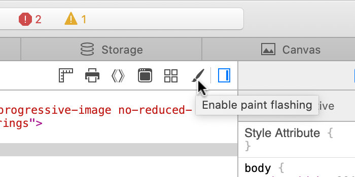
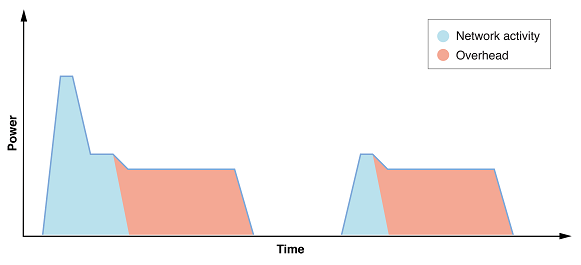

## [译]Web网页内容是如何影响电池功耗的

用户将大部分的在线时间花费在移动设备上，其余的大部分是用户使用不受限制的便携式计算机。对于两者而言，电池寿命都是至关重要的。在这篇文章中，我们将讨论影响电池寿命的因素，以及您作为一名Web开发人员如何使您的页面更节能，以便用户可以花更多时间与您的内容互动。

### 什么消耗电量？
移动设备上的大部分能量由几个主要组件消耗：

- CPU（主处理器）
- GPU（图形处理）
- 联网（Wi-Fi和蜂窝无线芯片）
- 屏幕

屏幕功耗相对恒定，并且大多在用户的控制下（通过屏幕的开启时间和亮度），但是其他组件（CPU，GPU和网络硬件）在功耗方面具有很高的动态范围。

系统会根据当前正在处理的任务来调整CPU和GPU的性能，这些任务当然包括渲染用户正在使用其Web浏览器和其他使用Web内容的应用程序与之交互的网页。这可以通过打开或关闭某些组件并更改其时钟频率来完成。广义上讲，芯片要求的性能越高，其功率效率就越低。硬件可以非常快速地提升到高性能（但是要付出很高的功耗），然后可以迅速返回到更有效的低功耗状态。

### 良好用电的一般原则
因此，为了最大程度地延长电池寿命，您希望减少在高功率状态下花费的时间，并使硬件尽可能多地回到空闲状态。

对于Web开发人员，需要考虑三种交互状态：

- 用户正在与内容进行交互时。
- 当页面位于最前面，但用户未与之交互时。
- 页面不是最前面的内容时。

#### 高效的用户互动
显然，在用户与页面进行交互时耗费力量是很好的。您希望页面快速加载并快速响应触摸。在许多情况下，减少首次涂漆时间和与用户互动的时间的相同优化也将减少功耗。但是，对于在初始页面加载后继续加载资源和运行脚本要谨慎。目标应该是尽快回到空闲状态。通常，运行的JavaScript越少，页面的效率就越高，因为脚本是在浏览器已经完成的布局和绘制页面的基础上工作的。

页面加载完成后，诸如滚动和点击之类的用户交互也将增加硬件功能（主要是CPU和GPU），这再次有意义，但是请确保在用户停止交互后立即回到空闲状态。另外，请尝试停留在浏览器的“快速路径”上-例如，正常的页面滚动将比JavaScript中实现的自定义滚动更加节能。

#### 将闲置电源使用率降至零
当用户不与页面交互时，请尝试使页面使用尽可能少的电量。例如：

尽量减少使用计时器，以免唤醒CPU。尝试将基于计时器的工作合并为几个不经常使用的计时器。许多不协调的计时器会触发频繁的CPU唤醒，这比将工作收集成更少的块要糟糕得多。
尽量减少动画内容，例如动画图像和自动播放的视频。特别要避免“加载”微调器的GIF或CSS动画，这些GIF或CSS动画会不断触发绘画，即使您看不到它们也是如此。IntersectionObserver仅可在可见时用于运行动画。
尽可能使用声明性动画（CSS 动画和Transitions）。当动画内容不可见时，浏览器可以优化这些内容，并且它们比脚本驱动的动画更有效。
避免进行网络轮询以从服务器获取定期更新。使用具有持久连接的WebSockets或Fetch，而不是轮询。
在应处于空闲状态时正在工作的页面也将对用户交互的响应降低，因此将后台活动最小化也可以提高响应速度和电池寿命。

#### 后台时CPU使用率为零
在多种情况下，页面变为非活动状态（不是用户的主要焦点），例如：

- 用户切换到其他选项卡。
- 用户切换到其他应用程序。
- 浏览器窗口最小化。
- 浏览器窗口是可见的，但不是焦点窗口。
- 浏览器窗口在另一个窗口后面。
- 窗口所在的空间不是当前空间。

当页面变为非活动状态时，WebKit会自动采取步骤来节省电量：

- `requestAnimationFrame` 已停止。
- CSS和SVG动画已暂停。
- 计时器受到限制。

另外，WebKit利用操作系统提供的功能来最大化效率：

- 在iOS上，如果可能，选项卡将完全挂起。
- 在macOS上，标签页会参与App Nap，这意味着未进行视觉更新的标签页的Web进程的优先级较低，并且计时器受到限制。

但是，页面可以通过计时器（setTimeout和setInterval），消息，网络事件等触发CPU唤醒。在后台时，应尽可能避免这些事件。有两个对此有用的API：

- 页面可见性API提供了一种方法来响应页面转换为后台还是前台。这是避免在页面处于后台时更新UI的好方法，然后在页面可见时使用visibilitychange事件来更新内容。
- blur每当页面不再集中时，都会发送事件。在这种情况下，页面可能仍然可见，但不是当前聚焦的窗口。根据页面的不同，停止动画可能是一个好主意。
查找问题的最简单方法是Web Inspector的时间表。该记录不应显示页面在后台时发生的任何事件。

### 狩猎效率低下
既然我们知道了网页耗电的主要原因，并给出了一些有关创建节能内容的一般规则，那么让我们来谈谈如何识别和修复导致耗电量过多的问题。

#### 脚本编写
如上所述，现代CPU可以将设备的闲置时的耗电量从非常低的坡度提高到非常高的水平，以满足用户交互和其他任务的需求。因此，CPU成为电池寿命变化的主要原因。页面加载期间的CPU使用率是浏览器引擎在加载，解析和呈现资源以及执行JavaScript时所做的工作的组合。在许多现代的网页上，执行JavaScript所花费的时间远远超过了浏览器在其余加载过程中所花费的时间，因此，最小化JavaScript执行时间将最大程度地提高功耗。

衡量CPU使用率的最佳方法是使用Web Inspector。如我们在上一篇文章中所示，时间轴现在显示任何选定时间范围内的CPU活动：

为了有效地使用CPU，WebKit在可能的情况下将工作分配到多个内核上（使用Workers的页面也将能够使用多个内核）。Web Inspector提供了与页面主线程同时运行的线程的细分。例如，以下屏幕截图显示了滚动具有复杂渲染和视频播放功能的页面时的线程：

在寻找要优化的东西时，请专注于主线程，因为那是您的JavaScript运行的地方（除非您使用的是Workers），然后使用“JavaScript和事件”时间轴来了解触发脚本的原因。也许您在响应用户或滚动事件方面做了太多工作，或者触发了requestAnimationFrame中隐藏元素的更新。了解页面上使用的JavaScript库和第三方脚本所完成的工作。要进行更深入的研究，可以使用Web Inspector的JavaScript探查器来查看在哪里花费时间。

“WebKit线程”中的活动主要是由与JavaScript相关的工作触发的：JIT编译和垃圾回收，因此减少运行的脚本数量并减少JavaScript对象的流失率可以降低这种情况。

WebKit调用的其他各种系统框架都使用线程，因此“其他线程”包括那些线程完成的工作；绘画是“其他主题”活动的最大贡献者，接下来我们将讨论绘画。

#### 绘画
主线程CPU使用率也可以由大量布局和绘画触发；这些通常是由脚本触发，但比其他属性的CSS动画transform，opacity并且filter还可能导致他们。查看“布局和渲染”时间轴将帮助您了解导致活动的原因。

如果“布局和渲染”时间轴显示绘画，但您无法确定正在发生的变化，请启用“绘画闪烁”：

这将使这些油漆用红色覆盖物短暂突出显示。您可能需要滚动页面才能看到它们。请注意，WebKit会保留一些“过度绘制”的图块，以实现平滑的滚动，因此在视口中不可见的绘制仍可以继续工作，以使屏幕外的图块保持最新状态。如果时间轴上显示油漆，则说明它在做实际的工作。

除了导致CPU耗电外，绘画通常还会触发GPU工作。macOS和iOS上的WebKit使用GPU进行绘画，因此触发绘画可能会导致功耗显着增加。额外的CPU使用率通常会显示在CPU使用率时间轴的“其他线程”下。

GPU还用于<canvas>2D画布和WebGL/WebGPU。为了最大程度地减少绘图，<canvas>如果画布内容没有更改，请不要调用API，并尝试优化画布绘图命令。

许多Mac笔记本电脑有两个GPU，一个“集成”GPU与CPU在同一个芯片上，功能不强但功耗更高，而功能更强大但功耗更高的“离散”GPU。WebKit默认情况下将使用集成GPU。您可以使用powerPreference上下文创建参数请求离散GPU ，但是只有在您可以证明功耗成本合理的情况下，才可以这样做。

#### 联网
无线网络会以意想不到的方式影响电池寿命。手机受到的影响最大，因为它们结合了功能强大的收音机（WiFi和蜂窝网络芯片）和较小的电池。不幸的是，在实验室之外测量网络的电源影响并不容易，但是可以通过遵循一些简单的规则来减少。

减少网络能耗的最直接方法是最大限度地利用浏览器的缓存。减少页面加载时间的所有最佳实践还通过减少无线电的开机时间而使电池受益。

另一个重要方面是将网络请求在时间上分组在一起。每当有新请求出现时，操作系统就需要打开无线电，连接到基站或蜂窝塔并传输字节。传输完数据包后，如果传输更多数据包，无线电将保持少量供电。

如果页面不频繁地传输少量数据，则开销可能大于传输数据所需的能量：

传输2个数据包之间有延迟的网络功率开销
可以从“ 网络请求时间线” 中的Web检查器中发现此类问题。例如，以下屏幕截图显示了在几秒钟内发送的四个单独的请求（可能是分析）：

同时发送所有请求将提高网络电源效率。

### 结论
网页可以成为电池寿命的好公民。

衡量Web Inspector中的电池影响并降低这些成本很重要。这样做可以改善用户体验和电池寿命。

延长电池寿命的最直接方法是最大程度地减少CPU使用率。新的Web Inspector提供了一种可以随时间进行监视的工具。

为了达到更长的电池寿命，目标是：

- 空闲时将CPU使用率降至零
- 在用户交互过程中最大化性能，以快速恢复闲置状态

原文链接：